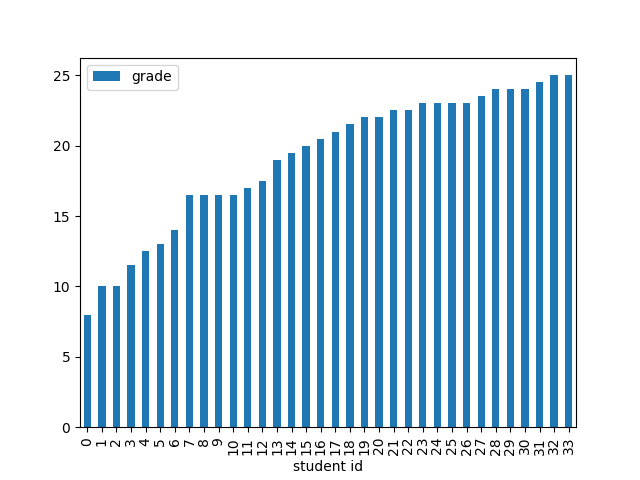

# Some number of the course in Spring 2022

## Overall
* Total number students accepted to the course (manual selection):68
* Active students: 48 (without dropout)
  - Student schools:
    - SCI:46
    - ELEC: 1
    - ENG: 1
* Doctoral students: 1 (based on available profiles)
* Exchange students: 1

## First assignment:
The first assignment is a critical test to see if the student fits into the course. Thus, we report its result here.
* Total submission: 34 (14 students did not submit)

## Second assignment:
* Total submission: 27 (7 students discontinued)

## Third assignment:
* Total submission: 26 (1 student discontinued)

## Final grades
