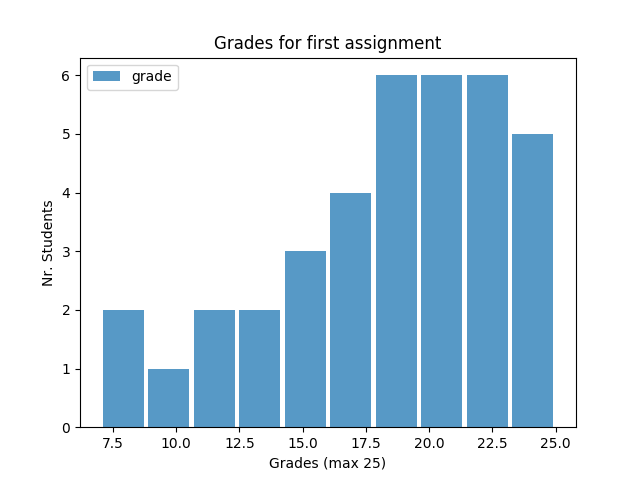

# Some number of the course in Spring 2021

* Total number involved students: 143
  - **45 suspended students** (from the system - do not know the reason)
  - **1 student allowed to audit** (late registration)
  - **97 active registered students**: not sure how many wants to audit the course.

* Student schools:
  - SCI:78
  - ELEC: 12
  - ENG: 3
  - BIZ: 4
* Active students: the students are joining the Teams
  - **72 (74.22%) of active registered students**
* Doctoral students (based on available profile)
  - **4**

* First assignment:
  - Submitted: **38 (39.17% of active registered students)**
  - BIZ: 1 (25% of BIZ students)
  - ENG: 0 (0% of ENG students)
  - ELEC:3 (25% of ELEC students)
  - SCI: 33 (42.3% SCI students)
  - 1 suspended/dropped submission (dropped/suspended after submission)

