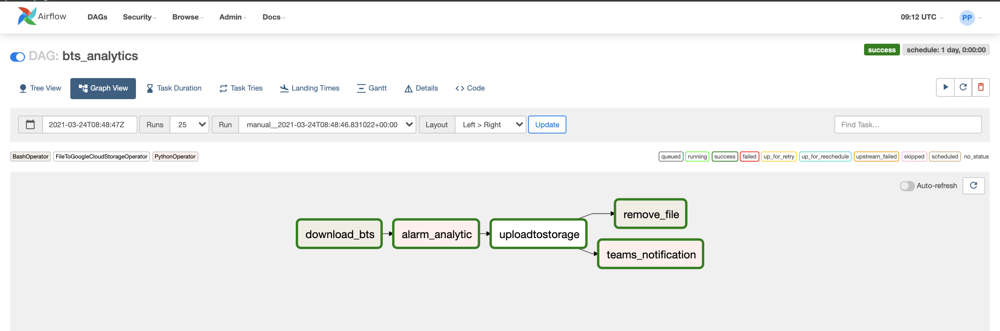
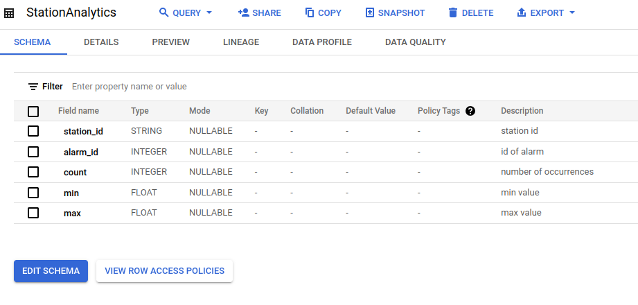

# Airflow Tutorial

>To be updated: BigQuery tasks

## Use Case Introduction

In this tutorial, we will practice [Apache Airflow](https://airflow.apache.org/) with simple activities:

1. Setup Apache Airflow in a local machine
2. Create simple workflows with Airflow
3. Set up Google Cloud Storage Connection
4. Set up Microsoft Teams Notification Connection
5. Run the workflow

>Note: there are many tutorials about Apache Airflow that you can take a look in the Internet, e.g. [Airflow tutorial](https://github.com/tuanavu/airflow-tutorial). There are also advanced tutorials/discussions to use Airflow in other contexts like [Tensorflow and Airflow](https://www.tensorflow.org/tfx/tutorials/tfx/airflow_workshop), [Airflow in Twitter](https://blog.twitter.com/engineering/en_us/topics/insights/2018/ml-workflows.html) and [Airflow in Lyft](https://eng.lyft.com/running-apache-airflow-at-lyft-6e53bb8fccff).

The final workflow on Airflow will look like this:


## Step1: Setup Apache Airflow 
Follow the instruction for [ installation guide for a local machine](https://airflow.apache.org/start.html). In this simple tutorial, we use Apache Airflow running in a local machine using [SequenceExecutor](https://airflow.apache.org/_api/airflow/executors/index.html).

> Note: There are other method to run Apache Airflow, such as [installing Apache Airflow](https://airflow.apache.org/installation.html) and [Google Cloud Composer](https://cloud.google.com/composer/) is a cloud-based version of Apache Airflow. You can try to use it if you have an access, but in this tutorial we will demo the use case when you install it on your local machine. 

There are some common error message that may appear during the setup:

* Need to upgrade package/python version 

> Solve: Create virtual environment
`conda create --name airflow python=3.6 sqlite=3.35.0`

* UTF-8 is not defined

> Solve: Export language variables
`export LC_ALL=en_US.UTF-8\nexport LANG=en_US.UTF-8` 


### Finally, check if the installation is OK
Following Airflow guide to see if the installation is ok. Run the following command in two different tabs.  

```
airflow webserver -p 8080
airflow scheduler
```

then check the [Airflow UI](http://localhost:8080)

## Step2: Create Simple Workflows

In this tutorial, we simulate a simple workflow for IoT alarm use case with the [BTS monitoring data](https://github.com/rdsea/bigdataplatforms/tree/master/data/bts).

In this use case, we first collect data from a remote site. The collected alarm data will be analyzed, then a report will be generated and stored in Google Cloud Storage. After the report is successfully stored, we will send a notification on Microsoft Teams to notify the user, and remove the downloaded file at the same time.

#### Check the source code and compile it

Check [the source of BTS Analytics in our Git](camerastateuploadfile/). It is a simple example for illustrating purposes. You can test if there is any error by

```
$python3 bts_analytics.py
```

> Note: There are some commands that might be only suitable for Linux/Mac, so if there is any problem, try modify the below source code and the path of directory. And also change the owner so generated report shows your name:

```
owner = 'hsin-yi-chen'
....
TMP_DIR="/tmp/bigdataplatforms"
....
downloadBTS = "curl -o " + destination_file + " " + source
removeFile = "rm {}".format(destination_file)
```

In case, you cannot see `bts_analytics` DAG in the DAGs list from the UI, please make sure that the you DAGs folder is referenced correctly in `airflow.cfg`.

## Step3: Set up Google Cloud Storage Connections

The workflow includes uploading file to google cloud storage. For this you need to have a Google Storage bucket available and service account to access the bucket:
```
GCS_CONF={
    "bucket":"bts_analytics_report",
    "gcp_conn_id":'bdp_gcloud_storage'
}
```
So we expect to have the service account for accessing the bucket **airflowexamples** that is defined in Airflow with the connection id **bdp_gcloud_storage**. Look at the following task:

```
t_uploadgcs =  LocalFilesystemToGCSOperator(
    task_id="upload_local_file_to_gcs",
    src=report_destination,
    dst=gcs_dest_file,
    bucket=GCS_CONF["bucket"],
    gcp_conn_id=GCS_CONF["gcp_conn_id"],
    dag = dag
    )

```


### Setup Google Cloud Storage

Normally for your own use, you will have to set up the google cloud storage and create service account yourselves.
For testing purpose, we have create a service account for you and will be given in Mycourses, and the bucket is **bts_analytics_report**. You can view the bucket [here](https://console.cloud.google.com/storage/browser/bts_analytics_report). 


### Setup Connection in Airflow

Follow the instruction [Managing Airflow connections](https://cloud.google.com/composer/docs/how-to/managing/connections) to set up connection in **Admin->Connections**.


>You can change the **bucket** and **gcp\_conn\_id** to suitable values in your GoogleCloudStorage. Read more about how does a connection works  [connection information in Airflow admin](https://airflow.apache.org/concepts.html#connections).

## Step4: Set up Microsoft Teams Notification Connection

To allow Airflow to send notifiaction to Teams, you need to set up incoming webhook on Teams and add the webhook url to Airflow using the connection as described above. Follow the instruction steps: **Prepare MS Teams** and **Prepare Airflow** from [here](https://code.mendhak.com/Airflow-MS-Teams-Operator/#prepare-ms-teams).

Instead of storing the webhook link into the code, we will store it into a Variable named **teams_webhook**. 

## (Optional)  Setup BigQuery

It is also possible to setup BigQuery service account and a table in BigQuery so that the data can also be stored into BigQuery. In BigQuery, you create a dataset and a table. The schema of the table in our example is as:


A service account is created with a permission to update data. In the code, we use Airflow Variable to store the bigquery service account under **bigquery-{PROJECT_ID}**:
```python
#just for flexibility to switch from a project to another for testing
PROJECT_ID="cs-e4640" 
BIGQUERY_CONF={
    "table_id":f'{PROJECT_ID}.btsanalytics.StationAnalytics',
    "project_id": PROJECT_ID
}

#similar way we put service account json for bigquery into a variable
#it is just one way, to refect different aspects of sharing secrets/common data
service_account_json=Variable.get(f'bigquery-{PROJECT_ID}', deserialize_json=True)

```

## Step5: Run the workflow

Run First copy your BTSAnalyitcs workflow into the dags directory of Airflow installation (usually $HOME/airflow)/dags

```
$cp bts_analytics.py ~/airflow/dags/
$cp -r analytics ~/airflow/dags/
```
or
```
$python3 /path_to_directory/bts_analytics.py
```

Now if you look at the [Airflow UI](http://localhost:8080), you would see the **bts_analytics** (and other example workflows).

Make sure that you turn it **ON** (see the icon **i** in the 2nd column of the UI). Then you can click to the workflow. In the UI of the workflow, you can examine the code, and run the workflow by "Trigger DAG". Check if it runs well.


## Further Actions

It is very basic but you can start to work on your advanced cases that you learn from the course.