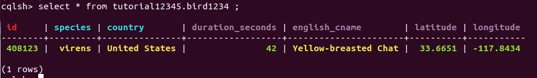

# Configuring 3-node Cassandra cluster using Docker Compose

## Introduction
[Apache Cassandra](https://cassandra.apache.org/) is an open source distributed database management system designed to handle large amounts of data across many commodity servers, providing high availability with no single point of failure. The docker image used for this tutorial is [cassandra](https://hub.docker.com/_/cassandra). The commands to be typed on the terminal window are preceded by a dollar ($) sign.
## Prerequisite
This instructions assume that you have [docker](https://docs.docker.com/get-docker/) and [docker compose](https://docs.docker.com/compose/install/) installed in your machine. You should also have at least 2GB of available RAM.


We use the data set [Avian Vocalizations from CA & NV, USA](https://www.kaggle.com/samhiatt/xenocanto-avian-vocalizations-canv-usa). However, we only use the metadata from the CSV file. Furthermore, we extract only a few fields.[A sample of extracted data is here](../consistency/sampledata.csv).
> There is a very good set of [exercises for basic data tasks](https://gist.github.com/jeffreyscarpenter/761ddcd1c125dfb194dc02d753d31733). You can use it to practice your work. We use the Avian example due to its large-scale nature.

## Configuring Cassandra cluster in a container

We basically create a Cassandra system with three nodes (machines):
* cluster name: *tutorials*
* Node 1: *cassandra1* in data center "DC1"
* Node 2: *cassandra2* in data center "DC1"
* Node 3: *cassandra3* in data center "DC2"

### Starting and inspecting the containers
The configuration of the cluster is given in the docker-compose.yml file.
1. Start the containers by running
    ```
    $ docker-compose up
    ```
2. To see the containers running and get their names, open another terminal and run
    ```
    $ docker-compose ps
    ```

### Testing the installation
Having obtained the container names from step 2 of the previous section, let us use them to enter into our Cassandra nodes.
1. For each container run
    ```
    $docker ps
    $ docker exec  -it <container_name> bash
    ```
2. Let's inspect our cluster using **nodetool status**

Use nodetool to check Cassandra nodes in different data centers.

    ```
    $ nodetool status

    ```
    ```
        Datacenter: DC1
        ===============
        Status=Up/Down
        |/ State=Normal/Leaving/Joining/Moving
        --  Address     Load       Tokens       Owns (effective)  Host ID                               Rack
        UN  172.31.0.3  251.88 KiB  256          100.0%            3ff30099-d2de-4141-b246-4a3db7e92fd9  rack1
        UN  172.31.0.2  168.24 KiB  256          100.0%            c58f39a6-cb5f-4f42-b993-a2258ac317ed  rack1
        Datacenter: DC2
        ===============
        Status=Up/Down
        |/ State=Normal/Leaving/Joining/Moving
        --  Address     Load       Tokens       Owns (effective)  Host ID                               Rack
        UN  172.31.0.4  194.93 KiB  256          100.0%            61b28950-b6b2-46f4-a757-c23b4f9e1b01  rack1
    ```


3. In order to interact with our database, let us enter the shell command
     ```
     $ cqlsh
    ```

>You can also use the cqlsh outside the container by running ```$docker run -it cassandra cqlsh [host] -u [username] -p [password]```

4. Create a keyspace called _tutorial12345_ with a replication factor of 3
    ```
    $CREATE KEYSPACE tutorial12345
      WITH REPLICATION = {
       'class' : 'SimpleStrategy',
       'replication_factor' : 3
      };
    ```
>Here you should see the replication_factor set to **3**. It means that given a data item, a row in a table, the data item will be replicated into **3** nodes. Consider our test with a system of three nodes, it means a data item will be available at all nodes.
5. Let's create a table named _bird1234_ inside this keyspace
    ```
    $CREATE TABLE tutorial12345.bird1234 (
       country text,
       duration_seconds int ,
       english_cname text ,
       id int,
       latitude float,
       longitude float,
       species text,
    PRIMARY KEY (id,species,country));
    ```
6. We now need to insert some values into our database
    ```
    $ INSERT INTO tutorial12345.bird1234 (country, duration_seconds, english_cname, id,  species, latitude, longitude) values ('United States',42,'Yellow-breasted Chat',408123,'virens',33.6651,-117.8434);
    ```
7. We can the retrieve the data from the database by sending the query
    ```
    cqlsh> select * from tutorial12345.bird1234 ;
    ```
    You should get
    

8. Let's do the same query on another node. This can be done by repeating steps 3 and 7 on the terminal (after step 1). The result of the query should be as in step 7.
9. To simulate node failures or outages. Let us stop two nodes. Run the following command twice each time giving the name of the node that you want to terminate:
    ```
    $ docker stop <container_name>
    ```
10. Run the following command to get the name of the running container
    ```
    $ docker-compose ps
    ```
11. Repeat steps 1, 3 and 7 for this container. You should get the same data

>Remember that we have **replication_factor==3** so a data item is replicated in 3 nodes. This shows that the data was correctly replicated across all our nodes and configuration was correct. Apache Cassandra has a lot of different configurations that were not covered in this tutorial and these can be found in cassandra's [documentation](https://cassandra.apache.org/doc/latest/configuration/index.html).

## Practices

* Study the replication mechanism of Cassandra
* Study the data sharding
* Learn how to scale up and down nodes of Cassandra
* Find a way to deploy in different machines so that you can test the network and performance
* Work on data storage for Cassandra
