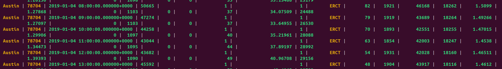

# Basic Cassandra: Configuring 3-node Cassandra cluster using Docker Compose

## Introduction

[Apache Cassandra](https://cassandra.apache.org/) is an open source distributed database management system designed to handle large amounts of data across many commodity servers, providing high availability with no single point of failure. The docker image used for this tutorial is [cassandra](https://hub.docker.com/_/cassandra). 

Key components of Cassandra are used in this tutorial:
- [nodetool](https://cassandra.apache.org/doc/latest/cassandra/troubleshooting/use_nodetool.html)
- [cqlsh](https://cassandra.apache.org/doc/latest/cassandra/managing/tools/cqlsh.html)
- [Cassandra Python driver](https://docs.datastax.com/en/developer/python-driver/3.29/index.html)

## Prerequisite

#### Computing Environments

We test with Linux environments.

#### Cassandra docker images

This instructions assume that you have [docker](https://docs.docker.com/get-docker/) and [docker compose](https://docs.docker.com/compose/install/) installed in your machine.

- using *docker pull* we will get the cassandra image and use it

#### Setup cqlsh 

Inside the cassandra docker image, you can find *cqlsh*. You can install a version of *cqlsh* in the local machine:
```
$rye sync
$source source .venv/bin/activate*
```

#### Data sets

In this example, we use [the OSF water open dataset](https://osf.io/g3zvd/?view_only=63e9c2f0cdf547d792bdd8e93045f89e). You can download that dataset and use a subset of records for testing.

> There is a very good set of [exercises for basic data tasks](https://gist.github.com/jeffreyscarpenter/761ddcd1c125dfb194dc02d753d31733). You can use it to practice your work. 

## Configuring Cassandra cluster in a container

We basically create a Cassandra system different nodes (machines):
* cluster name: *tutorials*
* Node 1: *cassandra1* in data center "DC1"
* Node 2: *cassandra2* in data center "DC1"
* Node 3: *cassandra3* in data center "DC2"

### Starting and inspecting the containers

The configuration of the cluster is given in the apache-compose.yml file.
1. Start the containers by running
    ```
    $ docker-compose -f apache-compose.yml up
    ```
2. To see the containers running and get their names, open another terminal and run
    ```
    $ docker-compose ps
    ```
> The docker names should be *basiccassandra-cassandra1-1,basiccassandra-cassandra2-1* and *basiccassandra-cassandra3-1* 

### Testing the installation

Having obtained the container names from step 2 of the previous section, let us use them to enter into our Cassandra nodes.
1. For each container, log into the cassandra node
    ```
    $ docker ps
    $ docker exec  -it <container_name> /bin/bash
    ```
2. Let's inspect our cluster using **nodetool status**

Use nodetool to check Cassandra nodes in different data centers.

```bash
$ nodetool status

```
 which shows some information like:
```
Datacenter: DC1
    ===============
    Status=Up/Down
    |/ State=Normal/Leaving/Joining/Moving
    --  Address     Load        Tokens  Owns (effective)  Host ID                               Rack 
    UN  172.23.0.4  119.75 KiB  16      59.0%             6164ee92-17ce-40f8-9c0f-4ec5f9f434bf  rack1
    UN  172.23.0.2  119.82 KiB  16      71.3%             2db8b1b7-8807-4dea-94ae-e4380470f026  rack1

    Datacenter: DC2
    ===============
    Status=Up/Down
    |/ State=Normal/Leaving/Joining/Moving
    --  Address     Load        Tokens  Owns (effective)  Host ID                               Rack 
    UN  172.23.0.3  114.69 KiB  16      69.7%             63e34913-dec5-43f7-a928-260b1076ea86  rack1

```

3. In order to interact with our database, let us enter the cqlsh shell command
     ```
     $ cqlsh
    ```

Notes:
>In this simple test: the cassandra system can be accessed without username/password
>You can also install a separate cqlsh and use the cqlsh outside the container by running ```$docker run -it cassandra cqlsh [host] -u [username] -p [password]```
>Or install python package for cqlsh: ```pip install cqlsh``` (or as mentioned before)

## Play with a simple example

#### Test data

Let us assume that we use the water data as input data and we want to manage the data.

Some examples of commands for *cqlsh* is avaiable under [sample water scripts](etc/sample_water.cqlsh)

#### Steps

1. Create a keyspace called _tutorial12345_ with a replication factor of 3
    ```
    cqlsh>CREATE KEYSPACE tutorial12345
      WITH REPLICATION = {
       'class' : 'SimpleStrategy',
       'replication_factor' : 3
      };
    ```
>Here you should see the replication_factor set to **3**. It means that given a data item, a row in a table, the data item will be replicated into **3** nodes. Consider our test with a system of three nodes, it means a data item will be available at all nodes.
2. Let's create a table named _water1234_ inside this keyspace
    ```
    cqlsh>CREATE TABLE tutorial12345.water1234 (
       timestamp timestamp, -- the time of data record
       city text,
       zip text,
       egridregion text,
       temperaturef int,
       humidity int,
       data_availability_weather int,
       wetbulbtemperaturef float,
       coal float,
       hybrid float,
       naturalgas float,
       nuclear float, 
       other float, 
       petroleum float,
       solar float,
       wind float,
       data_availability_energy float,
       onsitewuefixedapproach float,
       onsitewuefixedcoldwater float,
       offsitewue float,
    PRIMARY KEY ((city,zip), timestamp));
    ```

3. We now need to insert some values into our database
   
```
 cqlsh>INSERT INTO tutorial12345.water1234 
(timestamp, city, zip, egridregion, temperaturef, humidity, data_availability_weather, wetbulbtemperaturef, coal, hybrid, naturalgas,nuclear, other, petroleum, solar, wind, data_availability_energy,onsitewuefixedapproach, onsitewuefixedcoldwater,offsitewue) values(
'2019-01-01 00:00:00','Austin','78704','ERCT',42,76,1,37.9783997397202,51725,3010,36030,17927,1086,0,205,33383,1,1.34616023459296,0,1.6258769164237);
```

You can also load the csv file sample as:
```
cqlsh>COPY tutorial12345.water1234 
(timestamp, city, zip, egridregion, temperaturef, humidity, data_availability_weather, wetbulbtemperaturef, coal, hybrid, naturalgas,nuclear, other, petroleum, solar, wind, data_availability_energy,onsitewuefixedapproach, onsitewuefixedcoldwater,offsitewue)
FROM 'datasamples/water_dataset_v_05.14.24_1000.csv'
WITH HEADER = true AND DELIMITER = ',';
```

4. We can the retrieve the data from the database by sending the query
```
cqlsh> select * from tutorial12345.water1234 ;
```
You should get
    

>Note that usually we dont do **"select *"**. We use this as we put only a few record of data as an example.

5. Let's do the same query on another node. This can be done by repeating steps 3 and 7 on the terminal (after step 1). The result of the query should be as in step 7.
6.  To simulate node failures or outages. Let us stop two nodes. Run the following command twice each time giving the name of the node that you want to terminate:
    ```
    $ docker stop <container_name>
    ```
7. Run the following command to get the name of the running container
    ```
    $ docker-compose ps
    ```

>Remember that we have **replication_factor==3** so a data item is replicated in 3 nodes. This shows that the data was correctly replicated across all our nodes and configuration was correct. Apache Cassandra has a lot of different configurations that were not covered in this tutorial and these can be found in cassandra's [documentation](https://cassandra.apache.org/doc/latest/configuration/index.html).

>Further note: If you want to use the data set [Avian Vocalizations from CA & NV, USA](https://www.kaggle.com/samhiatt/xenocanto-avian-vocalizations-canv-usa), you can use statements in (etc/sample_bird.cqlsh). Note that, we only use the metadata from the CSV file. Furthermore, we extract only a few fields.[A sample of extracted data is here](../consistency/sampledata.csv).

## Practices

* Study the replication mechanism of Cassandra
* Study the data sharding
* Learn how to scale up and down nodes of Cassandra
* Find a way to deploy in different machines so that you can test the network and performance
* Work on data storage for Cassandra

## Scylladb

You can check [Scylla](https://www.scylladb.com/compare/scylladb-vs-apache-cassandra/) which is another Cassandra-compatible implementation.

We have a [simple docker compose](scylladb-compose.yml) for exercises.


## Author

- Strasdosky Otewa
- Linh Truong