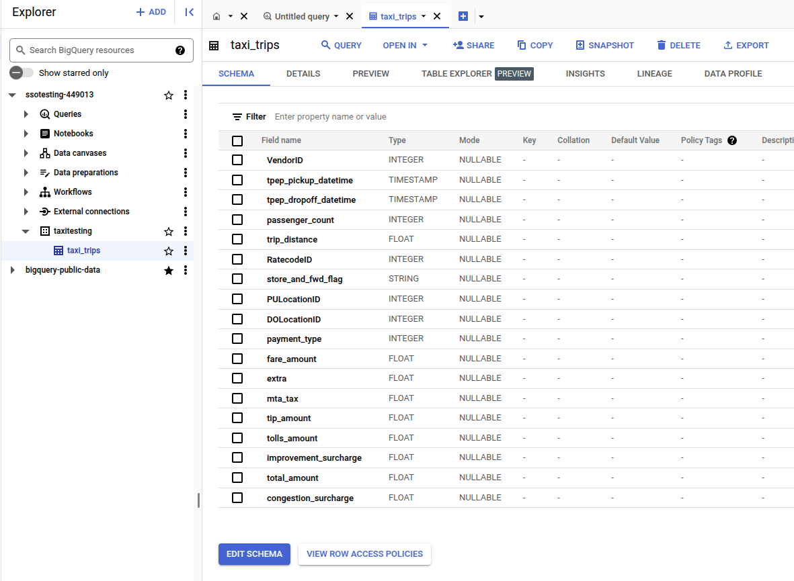

# Basic Distributed Query Examples

This shows a simple example of using [Trino](https://trino.io/) to query different data sources.

## Setting up Trino

We use Trino as a distributed query engine. We assume that we set it up in a simple mode: single coordinator. You can check the installation guide here.

For our example, we use 3 data sources: MongoDB, Cassandra and BigQuery. The example configuration files for Trino and data catalogs for the tree sources can be found under [trino configuration examples](config_examples/etc/)

## Setup different data sources

We will examine three different data sources that you have learned before:

- [Cassandra](../basiccassandra/)
- BigQuery: setup a project and service account
- MongoDB: set up a cluster or use Mongo Atlas

### Cassandra

Using [the tutorial basiccassandra](../basiccassandra/) to setup a simple data source for bird data.
>In this example, we have the keyspace name **tutorial12345** and the table **bird1234**

### Big Query

Using a Google Cloud Platform project to create a big query dataset and upload some taxi data as samples.


>In our test: we have the dataset **taxitesting** and the table name **taxi_trips**

### MongoDB

We can use Mongo Atlas or local mongodb and the listings dataset from Airbnb.
>In this test, we use mongodb atlas with database name **test** and the collection name **listings**

## Play with distributed query

Start Trino, e.g.,:
```
$trino-server-469/bin/launcher run
```

In another terminal, running python code:

```
$python src/basicdisquery/query_trino.py --config_file config_examples/config.yaml --ex_name mongodb
```

The code uses trino configuration in [config.yaml](config_examples/config.yaml). In the code, you see a list of simple queries, each for a data source. Using **ex_name** to indicate the case you want to test.

## Further notes

Clearly, the code and setup are very basic for a starting point. You can do complex settings and tests with your data sources.

- using trino command line to test queries
- write single queries applied to multiple data sources to analyze data from multiple sources. 
