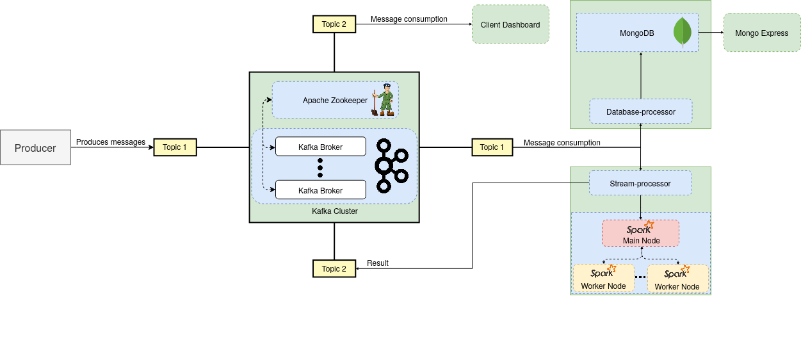
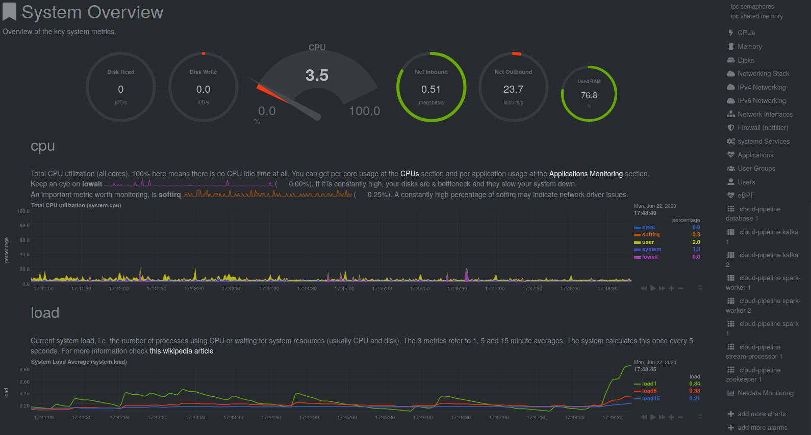

# Cloud-pipeline Subsystem

[](https://travis-ci.com/rohitshubham/Cloud-pipeline) [](https://hub.docker.com/r/rdsea/mongodb-database-ingestor "Checkout this on docker hub") [](https://hub.docker.com/r/rdsea/spark-job-submitter "Checkout this on docker hub")
### About the tool
This tool creates  a simple cloud system component of a big data processing architectecture. The repository includes basic code and tools required for readily setup a cloud component of a big data pipeline to enable developers and researchers perform additional testing of the code. This project works syncronously with the [edge-sim](https://github.com/rohitshubham/edge_simulator) project to quickly create a three tiered architecture.

---
### Different components
The overall workflow/architecture can be seen in Figure 1.

The different components available are:

* __zookeeper__ : Service discovery container required for apache kafka
* __kafka__: Message broker with scalability (See how to scale up/down the service below)
* __database__: MongoDB database for stream data ingestion
* __stream-processor__: Provides streaming analytics by consuming kafka messages for a fixed window interval
* __database-processor__: Provides database ingestion into the mongodb database
* __spark__: The master/controller instance of Apache Spark Node
* __spark-worker__: Worker nodes that connect the _spark_ service (See how to scale up/down the service below).
* __mongo-express__: Tool for connecting to _database_ service 

In addition, we also have Kafka message consumer code in `/Util` directory.



* Figure 1: Workflow and architecture of cloud pipeline sub-systems

---
### Running the Kafka
To run the cloud pipeline service, we need to perform the follwing:

#### 1. Starting Kafka

To start Kakfa, first run zookeeper:

```bash
$ docker-compose up -d zookeeper
```

Next start the Kafka brokers by:
```bash
$ docker-compose up --scale kafka=NUMBER_OF_BROKERS
```
#### 2. Start Mongo Databse
To start MongoDB, just run the command:

```bash
$ docker-compose up -d database
```

#### 3. Start the database-consumer:
To start the Kafka consumer service, run the following command while Kafka is running:

```bash
$ docker-compose up  --scale kafka=NUMBER_OF_BROKERS  database-processor
```

Note: The Kafka Consumer requires a comma seperated list of Kafka brokers. It has to be provided in the `entrypoint` config of the `docker-compose.yml` file.
Example: `entrypoint: ["python3", "MongoIngestor.py", "192.168.1.12:32812,192.168.1.12:32814", "kafka-database-consumer-group-2"]`

#### 4. Start Apache Spark
To start spark, run the following docker-compose command

* Start master/controller node
```bash
$ docker-compose up spark
```
* Start multiple instances of worker/resposender node
```bash
$ docker-compose scale spark-worker=2
```
#### 5. Start the stream-processor application

To start the stream-processor application, use the following command:

```bash
$ docker-compose up stream-processor
```
#### 6. Start the database-ingestion application
Start this using:

```bash
$ docker-compose up --scale kafka=2 database-processor
```

Note: The `database-processor` and `stream-processor` applications both belong to separate consumer groups in Kafka. As such, running both of them will provide simultaneous stream ingestion and processing capability.

#### 7. Kafka Message Consumer

The python script to consume any message on any topic in present in `/Utils` folder. Launch it as:

```bash
$ python3 client-report.py "kafka_broker" "topic_to_connect"
```
for example:

```bash
$ python3 client-report.py "192.168.1.12:32812,192.168.1.12:32814" report
```

---

### Monitoring the application
The recommended application for monitoring is [netdata](https://github.com/netdata/netdata).


* Figure 2: Sample application monitoring (Notice the containers at the bottom right)
---
