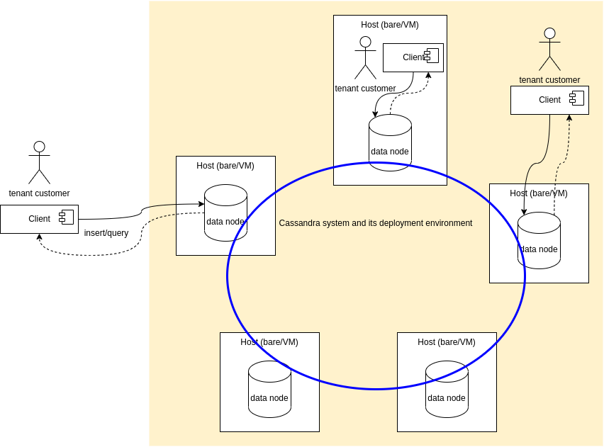

# Tutorial on Consistency and Performance
By Linh Truong

The goal of this tutorial is to study consistency support in big databases through the case of Cassandra. The focus is on understanding the consistency features provided by the systems and programmed by the developer and how they influence performance and data accuracy.
>We can only play with simple examples during the tutorial and you should conduct further hands-on to understand this subject.

Try to practice and read the following works in advance:
* [Basic Cassandra tutorial](../basiccassandra/README.md)
* [Cassandra consistency](https://docs.datastax.com/en/ddac/doc/datastax_enterprise/dbInternals/dbIntConfigConsistency.html)

The consistency level is associated with an operation (e.g. a query). It is based on *the replication_factor configured*(the number of replicas per data items) and *the available nodes* at runtime.

## 1. Setup Cassandra
The Cassandra under test is setup in Google Cloud Platform with 2 clusters, each has 3 nodes, using [Bitnami Cassandra images](https://docs.bitnami.com/google/infrastructure/cassandra/). 

We setup a deployment, as shown in the following figure:
.

> With this deployment you can think about different situations:
> - Should data consumers and producers be deployed within the cluster nodes or within the internal network of the cluster? When and when not
> - How to protect the cluster, given different possibilities of access of data consumers/producers?
> - Is the cluster for single tenant or for multiple tenants? What could be possible situations if the cluster is provided for multiple tenants?
> - How to scale the cluster?
> - Is it possible to have nodes in different data centers?

Dependent on the setup, we will have different internal and external IP addresses for accessing the cluster. For example, when we setup 5 nodes we will provide:

* **Node1Cluster1**: IP address to be obtained during the tutorial
* **Node2Cluster1**: IP address to be obtained during the tutorial
* **Node1Cluster2**: IP address to be obtained during the tutorial
* **Node2Cluster2**: IP address to be obtained during the tutorial

You need a username and password or public/private keys to access Cassandra:
>*will let you know*


You need to make sure that **cqlsh** and Cassandra Python Driver (as we use some python code examples) are installed in your machine:

* Download [Cassandra](http://cassandra.apache.org/) and install it. The **cqlsh** is in the **bin** directory.
>You can also use the cqlsh provided by **cassandra** container by running ```$docker run -it cassandra cqlsh [host] -u [username] -p [password]```
* Check Cassandra [Python Driver installation](https://github.com/datastax/python-driver):

```
pip[3] install cassandra-driver
```

If you use one of our node, Cassandra Python Driver has already been installed in the python virtual environment. To activate the python virtual environment, run:
```
$source virtualenv/bin/activate
```


## 2. Sample data

We use the data set [A Dataset for Research on Water Sustainability](https://osf.io/g3zvd/overview?view_only=63e9c2f0cdf547d792bdd8e93045f89e). However, students can download this dataset fully to test it as the big data in later steps. Furthermore, we extract only a few fields.

[A sample of the extracted data is here] tutorials/basiccassandra/datasamples/water_dataset_v_05.14.24_1000.csv
>If you dont use the python sample programs, you can also use other datasets, as long as you follow *CQL* samples by adapting them for your data.

## 3. Exercise Steps

In the following steps, we assume that username is *mybdp*.
After you SSH into VM to access the Cassandra Node (The key, ip address and username will be provided during the session )

### 3.1 Create a keyspace
Check the node address using nodetool:(name of container can be 'cassandra-seed' OR 'cassandra-2' OR 'cassandra-3' )
```
$nodetool status
```
Login into Cassandra using *cqlsh*: (The ip address, username and password will be given on the day of the tutorial)
```
$cqlsh [Node1|2|3] -u mybdp


```


The password will be provided in the tutorial session.
Choose your keyspace name, e.g. **tutorial-studentid**. Pls. keep the *replication factor* as in the following example.

```
mybdp@cqlsh>
CREATE KEYSPACE tutorial12345
  WITH REPLICATION = {
   'class' : 'SimpleStrategy',
   'replication_factor' : 3
  };
```

### 3.2 Create a table within the keyspace

Choose your table name, e.g., **water1234**
```
mybdp@cqlsh>
CREATE TABLE tutorial12345.water1234 (
       timestamp timestamp, -- the time of data record
       city text,
       zip text,
       egridregion text,
       temperaturef int,
       humidity int,
       data_availability_weather int,
       wetbulbtemperaturef float,
       coal float,
       hybrid float,
       naturalgas float,
       nuclear float, 
       other float, 
       petroleum float,
       solar float,
       wind float,
       data_availability_energy float,
       onsitewuefixedapproach float,
       onsitewuefixedcoldwater float,
       offsitewue float,
    PRIMARY KEY ((city,zip), timestamp));
```

### 3.3 Performing some basic checks
#### If you can get any information from the current Cassandra node

Using **cqlsh**

```
mybdp@cqlsh>SELECT * from tutorial12345.water1234;
```

#### Access data from another Cassandra node
Assume that you open a new terminal and connect to the cluster using **Node2** or **Node3**:

```
mybdp@cqlsh>SELECT * from tutorial12345.water1234;
```

what do you see?

#### Test if you can connect to Cassandra using a Python program
Run the below code from you PC terminal (change the path of the .py file accordingly)

```
python consistency/test_connection.py \
  --hosts <node ip> \
  --u mybdp \
  --p 'password' \
  --q SELECT * FROM tutorial12345.water1234;"


```

### 3.4 Programming consistency levels

#### Insert data by connecting to **Node1**
```
mybdp@cqlsh>
INSERT INTO tutorial12345.water1234 
(timestamp, city, zip, egridregion, temperaturef, humidity, data_availability_weather, wetbulbtemperaturef, coal, hybrid, naturalgas,nuclear, other, petroleum, solar, wind, data_availability_energy,onsitewuefixedapproach, onsitewuefixedcoldwater,offsitewue) values(
'2019-01-01 00:00:00','Austin','78704','ERCT',42,76,1,37.9783997397202,51725,3010,36030,17927,1086,0,205,33383,1,1.34616023459296,0,1.6258769164237);
```

you can copy data from the dataset and insert data as many as you want.

#### Check tracing with consistency using **cqlsh***

From **Node2** or **Node3**, check if you see the data:

first make sure you turn on tracing:
```
mybdp@cqlsh>TRACING ON;
```

then you can set consistency level, e.g. **ONE, QUORUM, ALL**:

```
mybdp@cqlsh>CONSISTENCY QUORUM;
```

Write a simple query, e.g.,

```
mybdp@cqlsh>SELECT * from tutorial12345.water1234;
```
The analyzing the trace to understand how Cassandra handles queries

Note:
> You can capture log of the trace for later study by using CAPTURE:
> cqlsh> CAPTURE
> cqlsh> CAPTURE '/home/yourhome/cse4640-trace.csv';

####  Programming consistency levels

Using different nodes, you can try to run a read test using Python to see the performance and data accuracy:

```
python3 consistency/test_consistency_read.py --host [node ip] --u mybdp --p [password] --q "SELECT * FROM tutorial12345.water1234"
```
What do you see, compared with a similar query from other nodes.

>*But it might be  hard to see the difference of performance and some data accuracy problems if we dont have a very large data set and do not access the data from different nodes.*

### Change consistency levels for write operations

#### Insert data with ONE, QUORUM, or ALL consistency level

Change the level of consistency in the code and see if it affects the performance.
```
python3 test_consistency_write.py --hosts <node ip> --u mybdp --p [password]
```
Check if you program works.

>Note: you can also modify the code:

```
cluster = Cluster(hosts,port=9042,auth_provider=auth_provider)
```
by replacing **host** with
```
[node1,node2,node3]
```

#### At the same time, read data with ONE, QUORUM, or ALL consistency level

Login into **Node2** or **Node3**

* Can you see the performance difference?
* Can you see some data accuracy problems?

### Changing replication factor in the table and test again

You can repeat the previous tests but with a different replication level, e.g, **2**:

```
mybdp@cqlsh>CREATE KEYSPACE tutorialfactor2
  WITH REPLICATION = {
   'class' : 'SimpleStrategy',
   'replication_factor' : 2
  };
```
Choose your table name, e.g. water1234
```
mybdp@cqlsh>CREATE TABLE tutorial12345.water1234 (
       timestamp timestamp, -- the time of data record
       city text,
       zip text,
       egridregion text,
       temperaturef int,
       humidity int,
       data_availability_weather int,
       wetbulbtemperaturef float,
       coal float,
       hybrid float,
       naturalgas float,
       nuclear float, 
       other float, 
       petroleum float,
       solar float,
       wind float,
       data_availability_energy float,
       onsitewuefixedapproach float,
       onsitewuefixedcoldwater float,
       offsitewue float,
    PRIMARY KEY ((city,zip), timestamp));
```

Then if you set consistency level THREE and query:
```
mybdp@cqlsh>CONSISTENCY THREE;
mybdp@cqlsh> select * from tutorialfactor2.water1234;
```

What do you get?

If you repeat the above-mentioned examples with **CONSISTENCY TWO**, what do you get?

## 3.5 Test if nodes in the cluster fail

Assume that the node you connect fails, try to connect to different hosts. What do you get?

## 4. Hot and Cold Spaces

 
In real-world systems, not all data is accessed equally. Recent data is usually queried frequently and requires low latency (hot data), while older data is accessed rarely and can tolerate higher latency (cold data). In Cassandra, this separation is typically handled at the data-modeling and application level.

In this tutorial, we demonstrate a simple hot → cold data transition using two tables.

## 4.1 Create Hot and Cold Tables

We store recent records in a hot table and move older records into a cold table.
```
mybdp@cqlsh>CREATE TABLE tutorial12345.water_hot (
  timestamp timestamp,
  city text,
  zip text,
  egridregion text,
  temperaturef int,
  humidity int,
  data_availability_weather int,
  wetbulbtemperaturef float,
  coal float,
  hybrid float,
  naturalgas float,
  nuclear float,
  other float,
  petroleum float,
  solar float,
  wind float,
  data_availability_energy float,
  onsitewuefixedapproach float,
  onsitewuefixedcoldwater float,
  offsitewue float,
  PRIMARY KEY ((city, zip), timestamp)
) WITH CLUSTERING ORDER BY (timestamp DESC);
```

```
mybdp@cqlsh>CREATE TABLE tutorial12345.water_cold (
  timestamp timestamp,
  city text,
  zip text,
  egridregion text,
  temperaturef int,
  humidity int,
  data_availability_weather int,
  wetbulbtemperaturef float,
  coal float,
  hybrid float,
  naturalgas float,
  nuclear float,
  other float,
  petroleum float,
  solar float,
  wind float,
  data_availability_energy float,
  onsitewuefixedapproach float,
  onsitewuefixedcoldwater float,
  offsitewue float,
  PRIMARY KEY ((city, zip), timestamp)
) WITH CLUSTERING ORDER BY (timestamp DESC);

```

## 4.2 Writing and Reading Hot Data

All new incoming data is written only to the hot table: (Add any data you want)
```
mybdp@cqlsh>INSERT INTO tutorial12345.water_hot (...) VALUES (...);
```

Typical operational queries read from the hot table:
```
mybdp@cqlsh>SELECT * FROM tutorial12345.water_hot
WHERE city='Austin' AND zip='78704' LIMIT 50;
```

## 4.3 Moving Data from Hot to Cold (Application-level Script)

After a certain time period (e.g., older than a few minutes or days), data is migrated from hot to cold using a small application-level script:

1.Read old records from water_hot (older than a cutoff timestamp)

2.Insert them into water_cold

3.Delete them from water_hot

This simulates how frequently accessed data gradually becomes archival data.

A simple migration script (in Python) can be found at : consistency/migrate_hot_to_cold.py

Save as: consistency/migrate_hot_to_cold.py

Run it:
```
python3 consistency/migrate_hot_to_cold.py --host [Node1|2|3] --u mybdp --p [Password] --city Austin --zip 78704 --cutoff_minutes 5
```

After migration, verify:
```
mybdp@cqlsh>SELECT count(*) FROM tutorial12345.water_hot;
mybdp@cqlsh>SELECT count(*) FROM tutorial12345.water_cold;
```

Note:
For tutorial simplicity, the script migrates data for a single partition (city,zip). In real systems, hot→cold movement is typically done via scheduled ETL jobs, streaming pipelines, or batch processing (e.g., Spark/Dataflow), and is modeled to avoid heavy filtering.

## 4.4 Relation to Consistency

Different consistency levels can be applied depending on data temperature:

1.Hot data: typically written and read using QUORUM

2.Cold data: often written and read using ONE, as it is less latency-sensitive


## 5. Some References

* https://docs.datastax.com/en/ddac/doc/datastax_enterprise/dbInternals/dbIntConfigConsistency.html
* https://docs.datastax.com/en/ddaccql/doc/cql/cql_reference/cqlsh_commands/cqlshTracing.html#cqlshTracing__examples
* [Performance experiments of Cassandra in Azure](https://github.com/Azure-Samples/cassandra-on-azure-vms-performance-experiments/)

