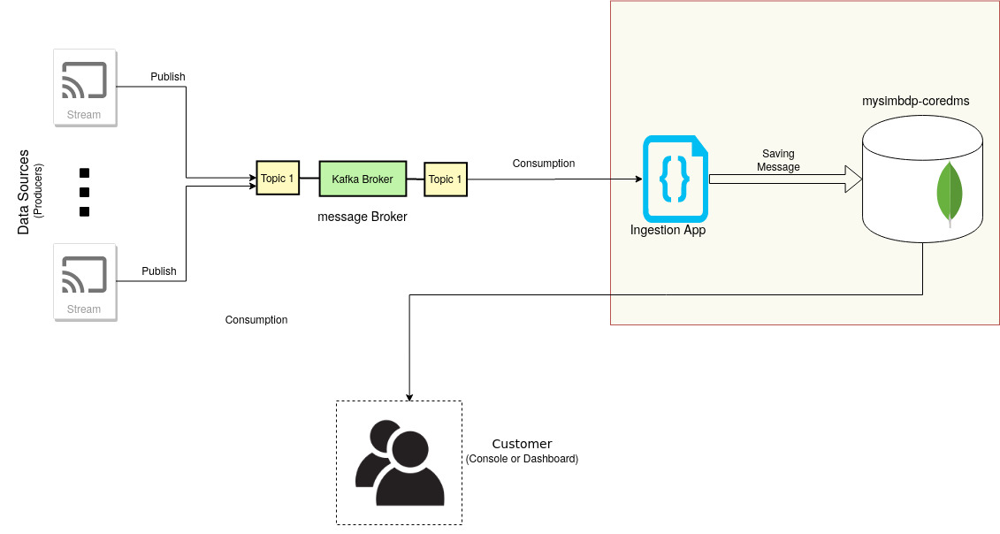

# Tutorial: Streaming ingestion into MongoDB

This tutorial deals with performing ingestion of streaming data into the MongoDB database.

* [An accompanying video is also available](https://aalto.cloud.panopto.eu/Panopto/Pages/Viewer.aspx?id=040abd7d-e500-456c-b05b-abe600b9ff70)
* [Slides](slide/cs-e4640-hands-on-ingestion-into-mongodb.pptx)

### Prerequisite knowledge:
- docker and docker-compose
- Basic idea about message brokers and Apache Kafka
- NoSQL database such as mongodb

The tutorial uses python for writing custom components.

### Python dependencies:
The following two were the python dependencies:
- kafka-python==2.0.1
- pymongo==3.10.1


### Code and deployment files:
All the relevant code used in the tutorial can be found here at:

- [Cloud-pipeline Subsystem](../cloud-data-pipeline)
- Sample Kafka Producer code is in: [Spark Streaming tutorial](../spark-streaming/code)


### Workflow and Architecture

This tutorial was designed to be write-intensive in nature. Hence, all the write operation will go through an message queue (Kafka in our case). Kafka was chosen as a data-ingestor component as to prevent loss of streaming data in case of temporary DB failure and prevent crashing of database in case incoming request rate exceeds database insertion speed during peak hours.

The implementation and the message flow follows the architecture below:


* Figure 1: Architecture of the tutorial

One of the prime motivations for selecting MongoDB as our data saving platform was the easy support for horizontal scaling. It scales horizontally by sharding the data across multiple servers. It also ensures data redundancy via the use of replicas of each shard.

### Implementation


## Steps for performing the ingestion

#### 1. Start the apache kafka

To start Kafka, first run zookeeper:

```bash
$ docker-compose up -d zookeeper
```

Next start the Kafka brokers by:
```bash
$ docker-compose up --scale kafka=1
```

the relevant docker-compose service looks like:

```yaml
  zookeeper:
    image: wurstmeister/zookeeper
    ports:
      - "2181"
  kafka:
    image: wurstmeister/kafka
    ports:
      - "9092"
    environment:
      KAFKA_ADVERTISED_HOST_NAME: 192.168.0.1
      KAFKA_ZOOKEEPER_CONNECT: zookeeper:2181
    volumes:
      - /var/run/docker.sock:/var/run/docker.sock
```
#### 2. Kafka Producer
Next, start the Kafka producer. A sample Kafka producer can be found here:[cloud_publisher.py](spark-streaming/code/cloud_publisher.py)

The publisher should start producing messages at certain intervals.

#### 3. Mongo DB service:
Start MongoDB service and expose the relevant port

```bash
$ docker-compose up -d database
```


```yaml
  database:
    image: mongo:latest
    ports:
      - "27017:27017"
    volumes:
      - /mnt:/data/db
```

#### 4. Start mongo Express
Start the mongo express and connect to mongoDB database. The docker-compose service should be similar to:

```bash
$ docker-compose up -d mongo-express
```


```yaml
  mongo-express:
    image: mongo-express
    ports:
      - "8081:8081"
    environment:
      - ME_CONFIG_MONGODB_SERVER=database
      - ME_CONFIG_MONGODB_ENABLE_ADMIN=true
```
This will enable us to browse all the databases.

#### 5. Start IngestionApp

Finally, start the ingestion application that
1. listens and consumes the messages on the certain topic from the Kafka broker.
2. Adds metadata and does some data formatting
3. Pushes the data into the database i.e. the mongodb service.

A sample MongoDb Ingestion application for reference  can be found in: [cloud-data-pipeline](../cloud-data-pipeline/DatabaseIngestor/MongoIngestor.py)

---

### Things to remember:
* We must take care of Kafka Consumer groups and perform offset management to ensure that messages are being delivered correctly.
* MongoDb works very well with JSON format and hence, using JSON while producing messages can reduce significant overhead of data formatting while ingestion.
* We can also use `msgpack` to improve the performance of message bytes while sending data over Kafka broker.


---
This tutorial is meant to serve as a definitive guide and not a step-by-step walkthrough and hence, the steps might slightly differ depending on the system and development environment.
