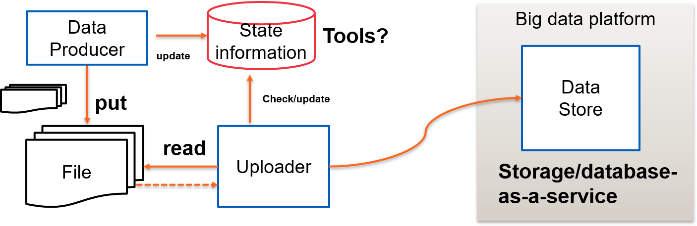

# Queue-based Data Ingestion

## Introduction
This tutorial shows a simple, plain example of using queue-based jobs for data ingestion. Basically, data ingestion tasks will listen a queue and based on the received notification, the ingestion tasks will pull the data (from remote place) and perform the ingestion. Given the following model, the queue is used to store states whereas the uploader is a data ingestion task accessing files through REST API.



To illustrate the example, we assume that:
* A data producer puts files of CSV in a storage (e.g., REST-based service, S3, Google Storage)
* The data producer tells the ingestion workers that the data files are available
* The workers will perform the ingestion

## Message Broker/Queue for Notification
In this example, we use Redis. Make sure you have .env to store environment variables about Redis or using environment variable:

```
REDIS_HOST=
REDIS_PORT=
REDIS_PASSWORD=
```
## Distribute the ingestion requests

A simple data producer, [data_producer.py](data_producer.py), just gets URI of a data file and make a request:
```
$python data_producer.py --queuename [QUEUENAME] --uri [INPUT_FILE]
$python data_producer.py --queuename bigdatastudy --uri "https://raw.githubusercontent.com/rdsea/IoTCloudSamples/master/data/bts/alarm-2017-10-23-12-vn.csv"
```
You can modify the data producer as you want for study, suggestion:
* Sending and managing multiple requests
* Defining a clear message structure for requests and check the results


## Running the data ingestion job
You can select a machine where you want to run ingestion workers. The use **rq** command to run:
```
$rq worker [QUEUE_NAME] --url $REDIS_URL
```
with
* REDIS_URL is the full URI of the redis database
* QUEUE_NAME is the name of a queue, e.g., "bigdatastudy"

Another way is with a docker. The instance will listen the queue and when it is available it can run.

```
$docker run  -e "REDIS_URL=$REDIS_URL" cse4640/ingestionworker
```
to scale the ingestion, you can run many more dockers in different machines.

## Points for study
* Implementation:
  - you can use different queues, e.g. RabbitMQ with Celery, Amazon SNS
  - ingestion task can just store data temporary and let other tasks to perfor the ingestion
* Storage for data ingestion and data quality control
* Real-world production needs security, etc.
* Support multi-tenant models.

Furthermore, try to learn some real tools that use and schedule containers for data ingestion:

* [Airbyte](https://airbyte.com/)
